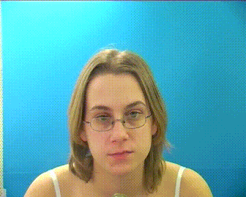

# LipNet: End-to-End Sentence-level Lipreading

The PyTorch implementation of 'LipNet: End-to-End Sentence-level Lipreading' by Yannis M. Assael, Brendan Shillingford, Shimon Whiteson, and Nando de Freitas (https://arxiv.org/abs/1611.01599). We use PyTorch to build the LipNet model with minor changes. This reproduction achieves 13.3%/4.6% WER in unseen/overlapped testing, which exceeds all evaluation metrics in the original paper and reaches **the state-of-the-art performance**.

## Demo




## Results

|       Scenario          |  Image Size (W x H) |  CER  |     WER    |
|:-----------------------:|:-------------------:|:-----:|:----------:|
|    Unseen speakers (Origin)    | 100 x 50 |    6.7%   |    13.6%   |
|   Overlapped speakers (Origin) | 100 x 50 |    2.0%   |    5.6%    |
|    Unseen speakers (Ours)      | 128 x 64 |  **6.7%** |  **13.3%** |
|   Overlapped speakers (Ours)   | 128 x 64 |  **1.9%** |  **4.6%**  |

**Notes**:

- These results are really hard to reproduce. For further research, the contribution to sharing the results of this model is highly appreciated (e.g. training logs, pretrained weights, learning rate schedulers, and so on) 

## Data Statistics

Following the original split, we use `s1`, `s2`, `s20`, `s22` in unseen speakers testing and choose 255 random sentences from each speaker in overlapped speakers testing.

|             Scenario            |   Train   |  Validation  |
|:-------------------------------:|:---------:|:------------:|
|    Unseen speakers (Origin)     |   28775   |     3971     |      
|   Overlapped speakers (Origin)  |   24331   |     8415     |
|    Unseen speakers (Ours)       |   28837   |     3986     |
|   Overlapped speakers (Ours)    |   24408   |     8415     |


## Data Preparation

We provide cropped lip images and annotation files in the following links: 

[BaiduYun (Code: jf0l)](https://pan.baidu.com/s/1I51Xf-DzP1UgrXF-S0L5tg)

The original GRID Corpus can be found [here](http://spandh.dcs.shef.ac.uk/gridcorpus/).

Download all parts and concatenate the files using the following command:

```
cat GRID_LIP_160x80_TXT.zip.* > GRID_LIP_160x80_TXT.zip
unzip GRID_LIP_160x80_TXT.zip
rm GRID_LIP_160x80_TXT.zip
```
The extracted folder contains `lip` and `GRID_align_txt` folders, which store the cropped lip images and the annotation files. 
You can create symbolic links to the `LipNet-PyTorch` project:

```
ln -s PATH_OF_DOWNLOADED_DATA/lip LipNet-PyTorch/lip
ln -s PATH_OF_DOWNLOADED_DATA/GRID_align_txt LipNet-PyTorch/GRID_align_txt
```

Beyond our provided data, if you want to establish a whole lip-reading pipeline by yourself, we provide code of face detection and alignment in the `scripts/` folder for reference. You can concat fengdalu@gmail.com or dalu.feng@vipl.ict.ac.cn for cooperation.

## Training And Testing

Run the program `main.py` to train and test LipNet model:

```
python main.py
```

To monitor training progress:

```
tensorboard --logdir logs
```

Data configurations and hyperparameters are configured in `options.py`. Please pay attention that you may need to modify it to make the program work as expected (e.g. data path, learning rate, batch size, and so on). The `options.py` should like this.

```
gpu = '0'
random_seed = 0
data_type = 'unseen'
video_path = 'lip/'
train_list = f'data/{data_type}_train.txt'
val_list = f'data/{data_type}_val.txt'
anno_path = 'GRID_align_txt'
vid_padding = 75
txt_padding = 200
batch_size = 96
base_lr = 2e-5
num_workers = 16
max_epoch = 10000
display = 10
test_step = 1000
save_prefix = f'weights/LipNet_{data_type}'
is_optimize = True

weights = 'pretrain/LipNet_unseen_loss_0.44562849402427673_wer_0.1332580699113564_cer_0.06796452465503355.pt'
```

Optional arguments:

- `gpu`: the GPU id used for training and testing
- `random_seed`: random seed for training and testing
- `data_type`: the data split in GRID Corpus, `unseen` and `overlap` is supported.
- `train_list`: The training index file. Each line contains a video folder like `s5/video/mpg_6000/lgbs5a`. The `dataset.py` will read all `*.jpg` files in the folder by the frame order.
- `test_list`: The testing index file. Same as `train_list`
- `anno_path`: The annotation root, which contains the annotation files `*.align` for each video.
- `vid_padding`: The video padding length, each video will be padded to `vid_padding` by zero.
- `txt_padding`: The txt padding length, each txt will be paded to `txt_padding` by zero.
- `batch_size`: The batch size for training and testing
- `base_lr`: The learning rate.
- `num_workers`: The number of processes used for data loading
- `max_epoch`: The maximum epochs for training
- `display`: The display interval in training and testing. For example, if `display=10`, the program will be print one time after 10 iterations.
- `test_step`: The interval for testing and snapshot. For example, if `test_step=1000`, the program will test after 1000 training iterations.
- `save_prefix`: The save prefix of model checkpoints.
- `is_optimize`: The training mode. If this is set to `False`, the model will test one time and exit.
- `weights`: The location of pre-trained weights. The model will load this weight before training or testing. If this parameter is missed, the model will be trained from scratch.

## Simple demo

We provide a simple demo of LipNet. You can run `python demo.py PATH_TO_YOUR_MP4` to watch. :)

## Dependencies

* PyTorch 1.0+
* opencv-python
* face_alignment (For demo only, https://github.com/1adrianb/face-alignment)

## Bibtex
    @article{assael2016lipnet,
	  title={LipNet: End-to-End Sentence-level Lipreading},
	  author={Assael, Yannis M and Shillingford, Brendan and Whiteson, Shimon and de Freitas, Nando},
	  journal={GPU Technology Conference},
	  year={2017},
	  url={https://github.com/Fengdalu/LipNet-PyTorch}
	}


## License

The MIT License
